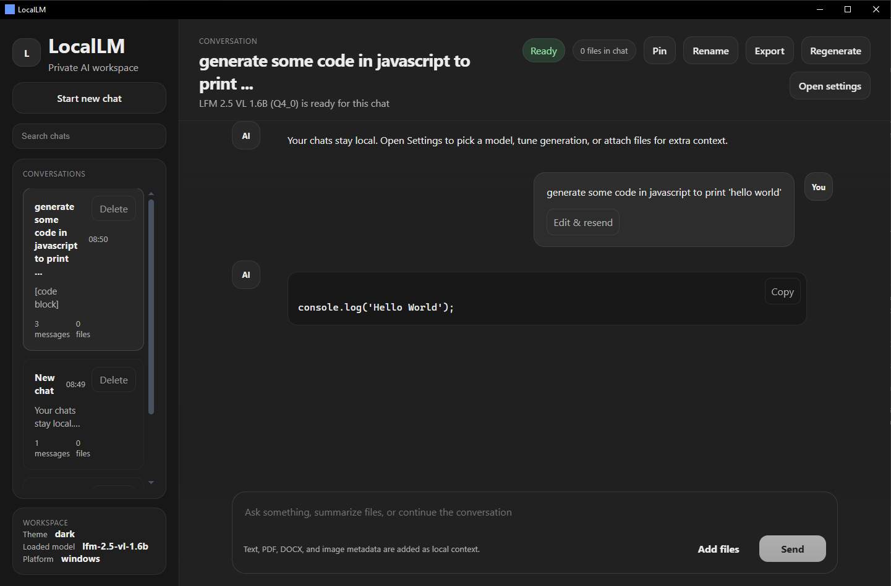

# LocalLM

Local-first chat app built with Tauri 2, React, TypeScript, and Rust.

The goal is a ChatGPT-style app that can run on:

- Windows desktop
- Android

and use local GGUF models instead of a cloud backend.

## Demo



## Current Status

### Desktop

Windows is the main verified path right now.

What works today:

- model downloads with progress and cancel
- model selection and persistence
- multi-chat UI with search, pinning, rename, delete, export
- attachment support for text, PDF, DOCX, and images
- streamed assistant replies
- markdown-style assistant rendering with copyable code blocks
- light, dark, and system theme
- settings panel for model/runtime/chat controls

### Runtime Split

The backend currently uses different runtime paths by platform:

- Windows desktop: local Ollama-backed chat
- Android: embedded `llama-cpp-2` runtime path in Rust

This is intentional for now.

Important note:

- Windows has been build-verified in this workspace.
- Android code has been implemented, but it has not yet been validated on a real device or emulator in this workspace.

## Included Models

- `lfm-2.5-vl-1.6b`
- `qwen-3.5-2b-q80`
- `qwen-3.5-4b-q4km`

Current default behavior:

- Desktop prefers `qwen-3.5-4b-q4km`
- Android prefers `lfm-2.5-vl-1.6b`

v1 is text-chat only.

`mmproj` metadata is stored for later multimodal work, but the app currently downloads and uses only the primary GGUF file.

## What The App Can Do

### Chat

- create multiple chats
- search chats
- pin chats
- rename chats
- delete chats
- export chats as Markdown
- edit and resend user messages
- regenerate the latest assistant reply

### Files

- attach multiple files to a message
- PDF text extraction
- DOCX text extraction
- text/code file extraction
- image preview and metadata capture
- per-attachment include/exclude before sending

### UI

- ChatGPT-style layout
- sticky composer at the bottom
- assistant markdown rendering
- copy buttons on code blocks
- responsive layout improvements for smaller screens

### Persistence

- theme preference persisted
- app settings persisted
- chat history persisted through the Tauri backend
- downloaded models detected on relaunch

## Current Limitations

- Windows chat depends on a local Ollama installation.
- Android local inference still needs real device validation.
- Android setup has not been completed in this workspace yet.
- Multimodal inference is not enabled yet, even for multimodal-capable model metadata.
- The Windows and Android runtimes are not unified yet.

## Project Structure

- `src/`
  - React frontend
  - chat UI
  - settings UI
  - attachment handling
  - markdown/code rendering
- `src-tauri/`
  - Rust backend
  - model download and runtime state
  - Windows Ollama integration
  - Android embedded inference path

## Requirements

## General

- Node.js
- Rust toolchain

## Windows Desktop

- Ollama installed and available in `PATH`
- LLVM / libclang available if you build paths that require native model bindings later

On this machine, LLVM is available through:

```powershell
$env:LIBCLANG_PATH='C:\Program Files\LLVM\bin'
```

## Android

To test Android, you still need the normal Android toolchain:

- Android Studio
- Android SDK
- Android NDK
- Java
- Rust Android targets

Typical env vars:

- `JAVA_HOME`
- `ANDROID_HOME`
- `NDK_HOME`

## Development

Install frontend packages:

```bash
npm install
```

Build the frontend:

```bash
npm run build
```

Check the Rust backend:

```powershell
cargo check --manifest-path src-tauri/Cargo.toml
```

Run the desktop app:

```powershell
npm run tauri dev
```

## Android Setup

This repo is not fully Android-initialized in this workspace yet.

The expected next commands are:

```powershell
npm run tauri android init
npm run tauri android dev
```

Before that, make sure your Android SDK / NDK / Java environment is configured.

## Verification Done In This Workspace

Most recent verified commands:

```powershell
npm install
npm run build
cargo check --manifest-path src-tauri/Cargo.toml
```

What has been verified here:

- frontend TypeScript build
- Rust backend desktop build path
- current README/runtime wiring consistency

What has not been verified here yet:

- real Android build
- real Android device/emulator run
- Android local inference performance and memory behavior

## Notes

- First-time Rust/native builds can be slow.
- Larger models need significant RAM and storage.
- The first time a model is loaded after Modelfile/template changes, the desktop path may rebuild the Ollama model.
- Browser/web preview uses the frontend preview state and is not the real native runtime.

## Recommended Next Steps

If the goal is a true Windows + Android local LLM app, the most important next step is:

1. initialize Android in this repo
2. run the first emulator/device test
3. fix any Android-specific runtime issues that appear
4. decide whether to keep the Windows/Android runtime split or unify both platforms later
